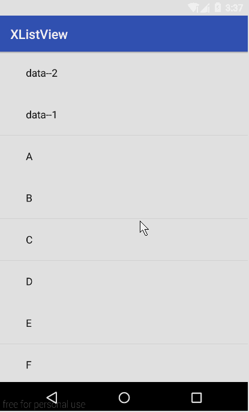

# xlistview
重写ListView添加下拉刷新

# 效果图


# 用法
* 布局文件写法和普通listview一样
```xml
<RelativeLayout
    xmlns:android="http://schemas.android.com/apk/res/android"
    xmlns:tools="http://schemas.android.com/tools"
    android:layout_width="match_parent"
    android:layout_height="match_parent"
    tools:showIn="@layout/activity_main"
    tools:context=".MainActivity">

    <cn.hzh.xlistview.view.XListView
        android:id="@+id/id_listview"
        android:layout_width="match_parent"
        android:layout_height="match_parent">

    </cn.hzh.xlistview.view.XListView>

</RelativeLayout>
```

* 代码使用

使用步骤如下：
* 1.首先，通过findViewById()方法，拿到XListview实例
```java
mXListView = (XListView) findViewById(R.id.id_listview);
```

* 2.通过XListView的enablePullRefresh()方法，开启下拉刷新功能；
```java
mXListView.enablePullRefresh(new XListView.XListViewRefreshListener()
{
    @Override
    public void onRefresh()
    {
	//执行耗时任务，比如从服务器上获取最新的数据
	new RefreshTask().execute();
    }
});
//开始刷新
mXListView.startRefresh();
```

* 3.数据刷新成功后，在UI线程停止刷新；比如在AsyncTask的onPostExecute()方法中执行
```java
protected void onPostExecute(Void aVoid)
{
    super.onPostExecute(aVoid);

    //数据获取成功
    mDatas.addFirst("data--1");
    mDatas.addFirst("data--2");
    //通知adapter数据发生改变
    mAdapter.notifyDataSetChanged();
    //停止刷新
    mXListView.stopRefresh();
}
```

# 实现方法简要分析
* 首先定义一个头部布局 header_lv.xml
```xml
<RelativeLayout xmlns:android="http://schemas.android.com/apk/res/android"
                android:id="@+id/id_header_content"
                android:layout_width="match_parent"
                android:layout_height="90dp">

    <LinearLayout
        android:layout_width="200dp"
        android:layout_height="match_parent"
        android:layout_centerInParent="true"
        android:orientation="horizontal">
        
        <RelativeLayout
            android:layout_width="0dp"
            android:layout_weight="1"
            android:layout_height="match_parent"
            android:layout_gravity="center_vertical">
            
            <ImageView
                android:id="@+id/id_arrow_iv"
                android:layout_width="wrap_content"
                android:layout_height="wrap_content"
                android:layout_centerInParent="true"
                android:src="@mipmap/xlistview_arrow"/>
            
            <ProgressBar
                android:id="@+id/id_progress"
                android:layout_width="30dp"
                android:layout_height="30dp"
                android:layout_centerInParent="true"
                android:visibility="invisible"/>
            
        </RelativeLayout>

        <LinearLayout
            android:layout_width="0dp"
            android:layout_weight="4"
            android:layout_height="match_parent"
            android:orientation="vertical"
            android:gravity="center">

            <TextView
                android:id="@+id/id_refresh_tip_tv"
                android:layout_width="wrap_content"
                android:layout_height="wrap_content"
                android:text="@string/pull_to_refresh"
                android:textSize="16sp"/>

            <TextView
                android:id="@+id/id_last_update_tv"
                android:layout_width="wrap_content"
                android:layout_height="wrap_content"
                android:text="@string/not_update_yet"
                android:textSize="16sp"/>

        </LinearLayout>
        
    </LinearLayout>

</RelativeLayout>
```

* 编写XListView类继承ListView。这个类主要负责：将头部布局以headerView的形式添加进去、
复写onTouchEvent()方法，监视用户Touch的过程中各种状态的切换、公布接口让实现外部刷新功能、以及
对外公布一些方法实现enable或者disable刷新功能等等。

* 编写XHeaderView类，该类继承自LinearLayout。为什么还要编写这个类呢？
主要是对头部布局进行封装。主要的负责: 改变头部布局高度、实现左侧箭头改变动画、
根据用户的touch来改变TextView的内容等等。